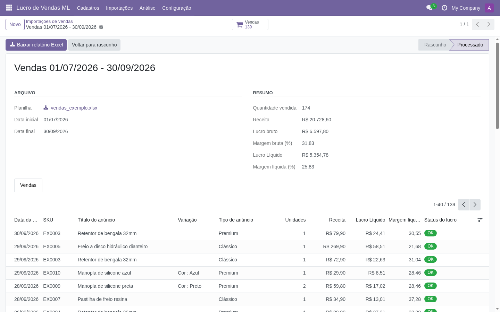
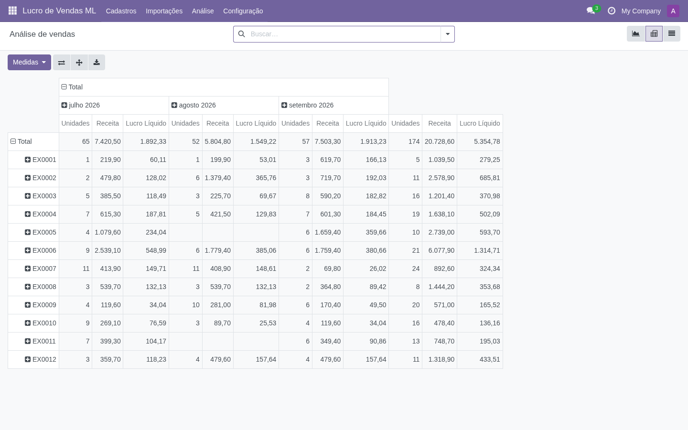
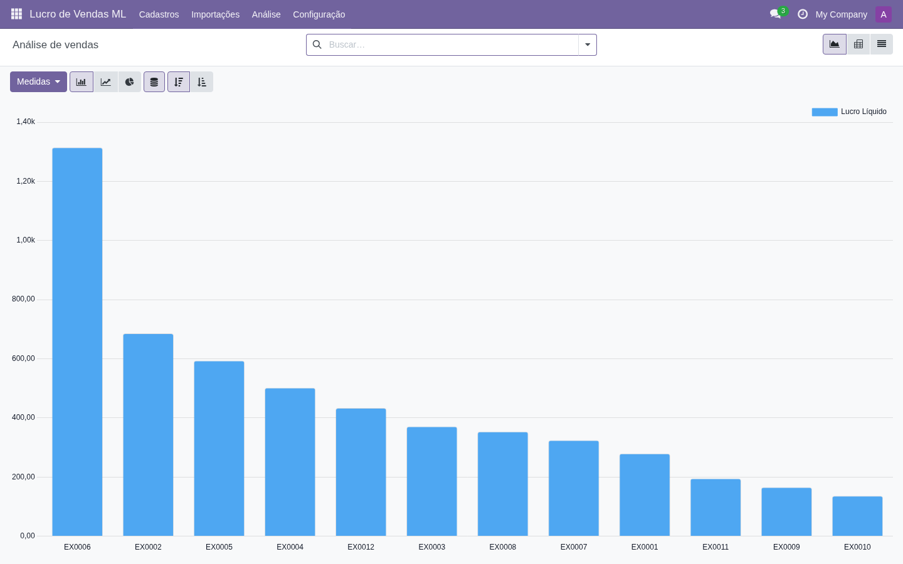
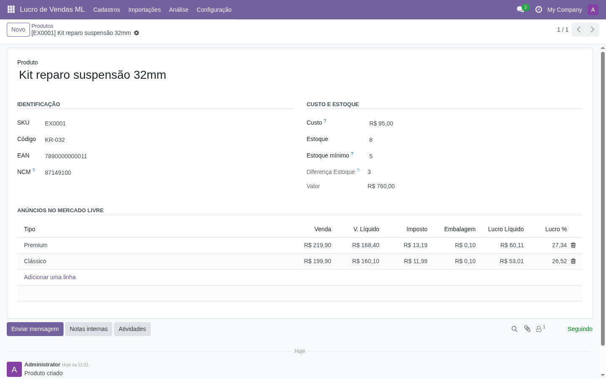
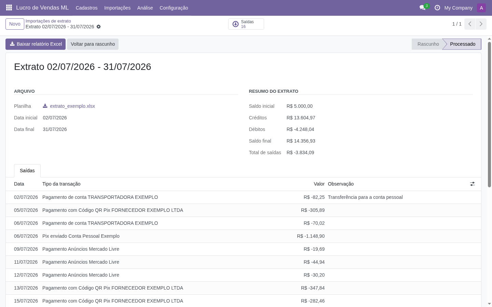

# App Mercado Livre

[](https://github.com/Nathan-Gobbi/app-mercado-livre/actions/workflows/pre-commit.yml?query=branch%3A18.0)
[](https://github.com/Nathan-Gobbi/app-mercado-livre/actions/workflows/test.yml?query=branch%3A18.0)
[](https://github.com/odoo/odoo/tree/18.0)
[](LICENSE)

<!-- /!\ do not modify above this line -->

Módulos Odoo para quem vende no **Mercado Livre** saber quanto vendeu e quanto lucrou
com cada produto, sem planilhas manuais.

O módulo nasceu de dois scripts em Python + pandas que eu usava toda semana no meu
e-commerce: um cruzava o relatório de vendas do Mercado Livre com a minha planilha de
estoque para calcular o lucro, e o outro filtrava as saídas do extrato. Agora tudo roda
dentro do Odoo, com histórico, análises e o mesmo relatório Excel que os scripts
geravam.



## O que o módulo faz

- **Cadastros com os campos da planilha**: produtos (SKU, Código, EAN, NCM, Custo,
  Estoque, Diferença Estoque, Valor) e anúncios Premium/Clássico (Venda, V. Líquido,
  Imposto, Embalagem, Lucro Líquido, Lucro %), com imposto e lucro calculados pelo Odoo.
- **Importação da planilha de estoque**: carrega produtos e anúncios da planilha Excel
  existente, inclusive variações de cor cujo custo vem de outra linha pela fórmula.
- **Importação de vendas**: cruza cada venda do relatório do Mercado Livre com o anúncio
  (SKU + tipo) e calcula receita, lucro bruto, lucro líquido e margens. Vendas
  canceladas são ignoradas, e importar períodos sobrepostos (a semana e depois o mês)
  não duplica vendas. O estoque é baixado automaticamente uma única vez e restaurado
  quando uma venda é cancelada.
- **Importação do extrato**: lista as saídas do extrato do Mercado Pago, ignorando os
  tipos de transação configurados, com um campo de observação para cada saída.
- **Análises**: gráfico, pivô e lista por SKU, produto, tipo de anúncio e mês.
- **Relatórios Excel**: os mesmos "Resumo_Estoque", "Resumo_Financeiro" e "Saídas" que
  os scripts originais geravam.

| Análise por mês (pivô)             | Lucro por SKU (gráfico)                 |
| ---------------------------------- | --------------------------------------- |
|  |  |

| Produto com os anúncios               | Extrato com observações             |
| ------------------------------------- | ----------------------------------- |
|  |  |

## Destaques técnicos

- **Reaproveita o Odoo nativo**: SKU, EAN e custo usam os campos do cadastro de produtos
  (`default_code`, `barcode`, `standard_price`). As telas do módulo mostram só as
  colunas da planilha, sem alterar as telas nativas usadas por outros apps.
- **Valores congelados na venda**: o lucro unitário é copiado do anúncio no momento da
  importação, então mudar preço ou custo depois não reescreve o passado.
- **Vendas sem duplicidade**: cada venda é identificada pelo número do Mercado Livre e
  pode pertencer a várias importações (`Many2many`). Uma venda cancelada depois é
  removida na importação seguinte.
- **Validado com dados reais**: o relatório gerado pelo Odoo foi comparado linha a linha
  com o do script original, para o mesmo arquivo. A diferença máxima foi de R$ 0,15 no
  total de 44 unidades, porque o Odoo arredonda o imposto em centavos.
- **Padrão OCA**: estrutura gerada com o
  [oca-addons-repo-template](https://github.com/OCA/oca-addons-repo-template),
  pre-commit (ruff, pylint-odoo, prettier), README gerado a partir de fragmentos,
  tradução pt_BR completa, grupo de acesso próprio e regras multiempresa.
- **Testes automatizados**: testes `TransactionCase` com planilhas fictícias geradas em
  memória, cobrindo cálculos, importações, relatórios e arquivos inválidos. Rodam no
  GitHub Actions a cada push.

## Tecnologias

Python 3.10, Odoo 18 (ORM, views XML, wizards, `res.config.settings`, segurança),
PostgreSQL, openpyxl, Docker ([Doodba](https://github.com/Tecnativa/doodba)) e GitHub
Actions.

## Como rodar localmente

O jeito mais simples é usar um projeto [Doodba](https://github.com/Tecnativa/doodba)
com Odoo 18. Clone este repositório em `odoo/custom/src/app-mercado-livre` e adicione
ao `odoo/custom/src/addons.yaml`:

```yaml
app-mercado-livre:
  - "*"
```

Depois:

```bash
invoke resetdb --modules=ml_sales_profit --no-demo
invoke start
invoke test --modules=ml_sales_profit   # roda os testes
```

Acesse http://localhost:18069 (usuário `admin`, senha `admin`). Em qualquer outra
instalação do Odoo 18, basta colocar a pasta `ml_sales_profit` no `addons_path` e
instalar o app **Lucro de Vendas ML**. A única dependência Python é o `openpyxl`, que já
vem com o Odoo.

## Testando com as planilhas de exemplo

A pasta [`sample_data`](sample_data) tem planilhas **fictícias** no mesmo formato das
reais:

1. _Cadastros > Importar planilha de estoque_ → `estoque_exemplo.xlsx`
2. _Importações > Vendas_ → Novo → `vendas_exemplo.xlsx` → **Processar**
3. _Importações > Extratos_ → Novo → `extrato_exemplo.xlsx` → **Processar**
4. Veja o resultado em _Análise_ e baixe o relatório Excel.

<!-- /!\ do not modify below this line -->

<!-- prettier-ignore-start -->

[//]: # (addons)

Available addons
----------------
addon | version | maintainers | summary
--- | --- | --- | ---
[ml_sales_profit](ml_sales_profit/) | 18.0.1.0.0 | <a href='https://github.com/Nathan-Gobbi'></a> | Import Mercado Livre sales and statements to analyze profit

[//]: # (end addons)

<!-- prettier-ignore-end -->

## Licença

Este repositório usa a licença [AGPL-3.0](LICENSE).

## Autor

**Nathan Gobbi**, desenvolvedor Python Jr. ·
[LinkedIn](https://www.linkedin.com/in/nathan-gobbi-de-oliveira-7616752a1/)
